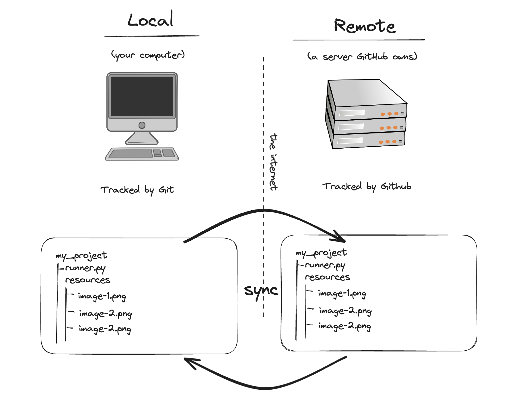
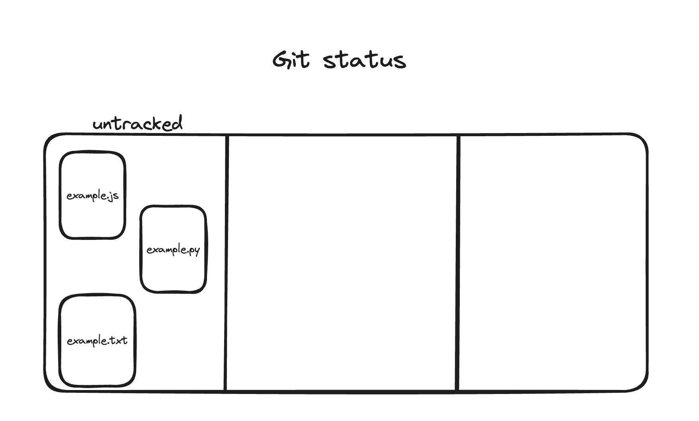
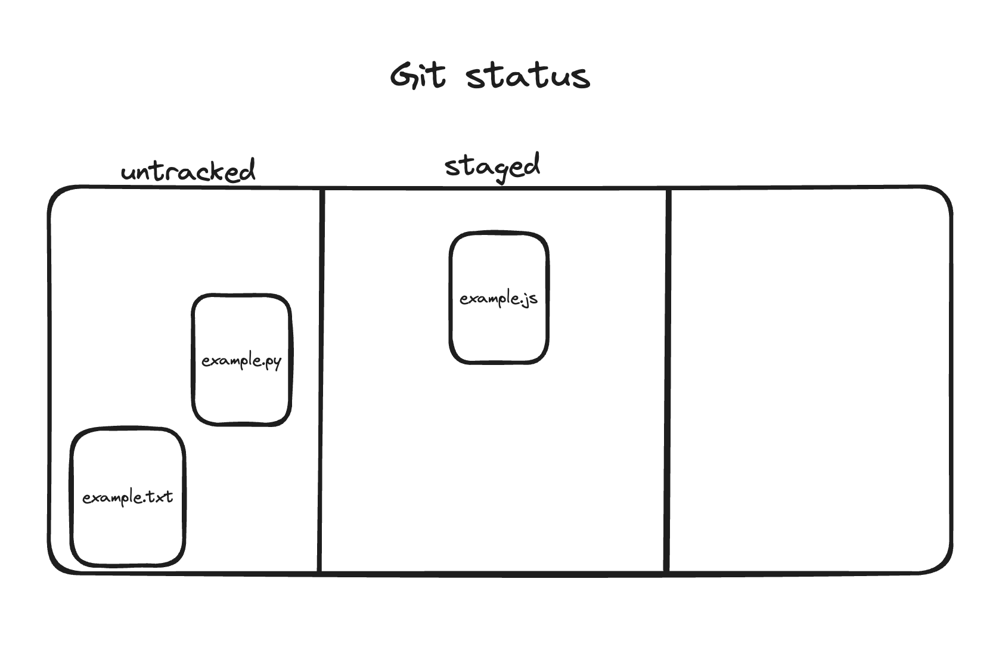
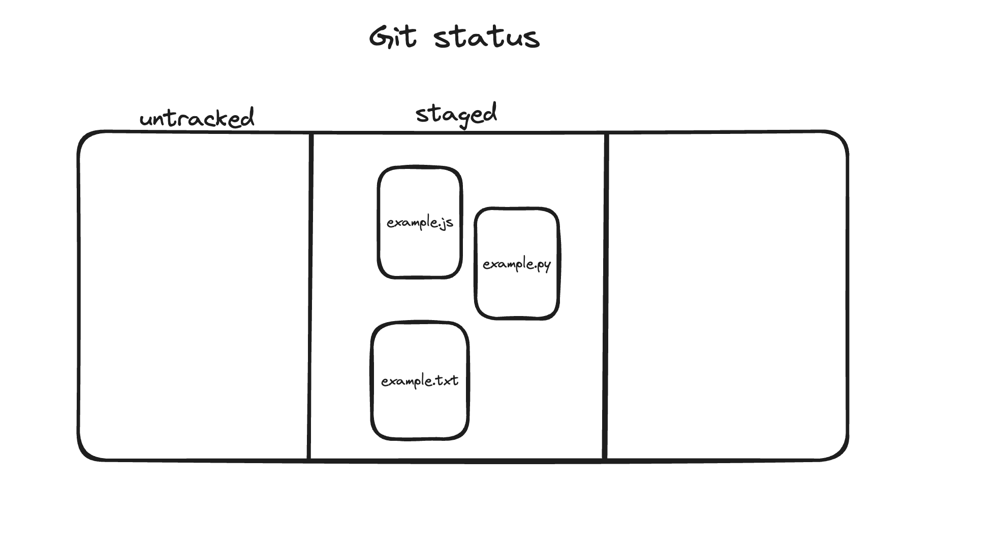
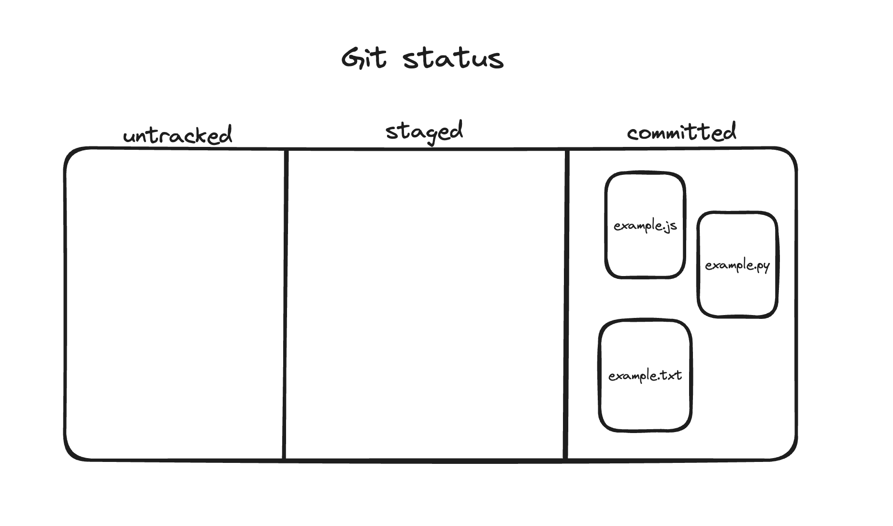
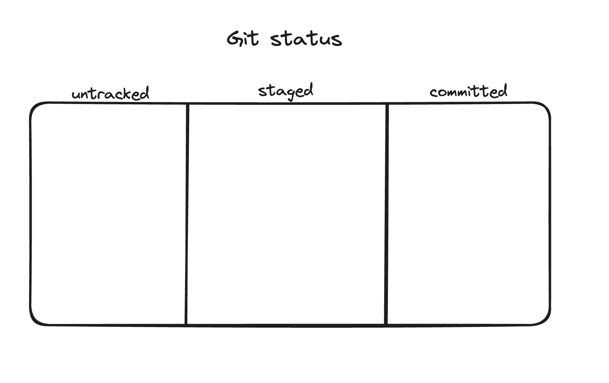
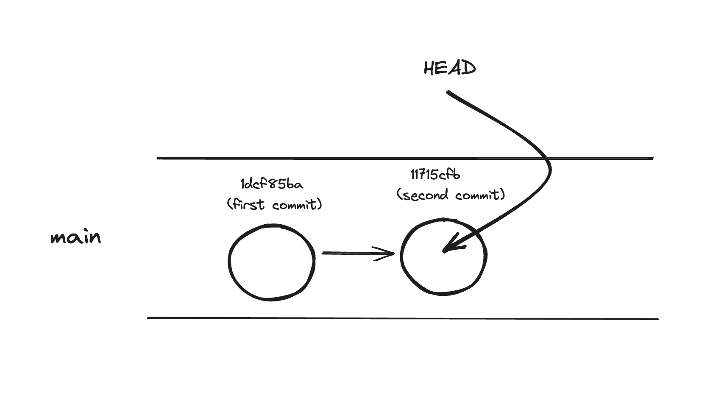
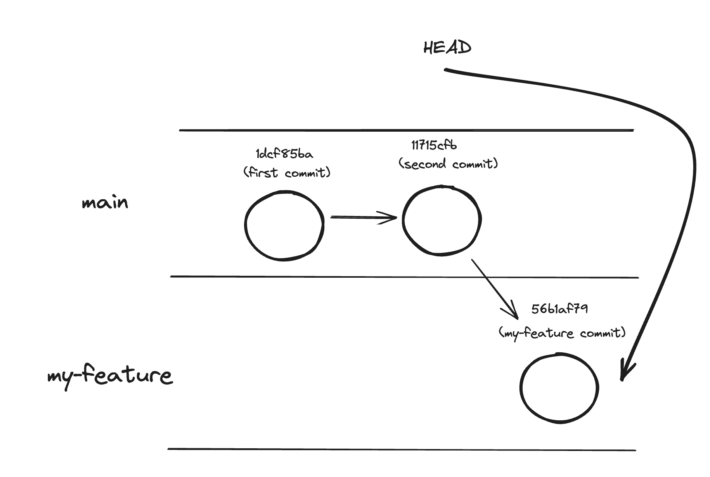

# Git Fundamentals

## What is Git?

**Git** is a just another command-line tool/program, the same as `mkdir` or `python`, but a uniquely important one for doing professional software development. Git is the de-facto **version control system** for source code. Have you ever saved some changes to a file only to realize a few hours later you deleted something you now want to recover? Git is how software developers manage their code changes so that the history of the project is _tracked_. As a result, we can never completely lose any of our work! Even if we outright delete something, we can always 'rewind' to an earlier point in the project's history to recover it!

### Git vs Github

This distinction will become more clear as we continue the lesson, but an important note to begin on - **Git is not the same thing as Github**!

- **_Git_** is the original invention, and it is designed to manage changes for a _local_ project living on your own personal computer.

- **_Github_** is a modern product/company (now owned by Microsoft) that aims to be the de-facto place to _back up_ your local git repo on the internet. Github let's you sync your local project (and it's history) with a _remote_ computer, so you even if your personal computer is destroyed, a copy of your project still exists in it's entirelty on the internet. This remote location is also useful for collaborating with others, but that's beyond the scope of this lesson.



### `git`

Git is a command-line tool like any other, so can be invoked on it's own with `git`. If that's all you type you will see a very long output explaining all the subcommands git supports, of which there are many. The first one we will explore however is `git init`, which allows us to turn a regular folder into a _git repo_.

### Creating a git repo

Any folder can be made into a git repo, so to begin, let's make a new empty folder somewhere on our filesystem. Assuming you are in the home directory (`~`) execute the commands:

```sh
mkdir my-first-repo
cd my-first-repo
```

Ok, we created a file and entered into it, what now? Well, let's see what's in there. Because it's a new, empty folder, it should be empty, right?!

```sh
ls -a
```

If you type `ls -a` (list, including hidden) you shouldn't see anything (besides `.` and `..`). But we want to make this a git repo, so let's do that before anything else.

```sh
git init
```

`git init` will make the current folder a git repo. What does this mean? Well, depending on your terminal and shell, you may already see some visual display implying the terminal understands this folder is a git repo. But how does it know? Type `ls -a` again. You should now see a folder called `.git`. You don't need to go in there and root around (in general you shouldn't) but this folder is what `git` itself uses to manage the folder as a git repo. There's ultimately no difference between an ordinary folder and a Git repo besides this file, but we say 'git repo' to imply it's being tracked in a way that Git is aware of.

`git status`

Before doing anything else, type `git status`. This will tell you the 'status' of the repo, as git sees it. Because we haven't done anything yet you should see something like:

```bash
On branch main

No commits yet

nothing to commit (create/copy files and use "git add" to track)
```

It's important when starting out to continually type `git status` between commands, as reading it's output will teach you what git is actually doing. Right now all it's telling us is that we are on a 'branch' called `main` (more on this later) and that we haven't done anything yet as far as Git is concerned.

So what is this 'commit' business? A 'commit' essentially means a set of changes that git is aware of. But before we can do this, we need to add some files.

### `git add`

We want to add files to our repo, so first let's create some files!

```sh
touch example.txt
touch example.py
touch example.js
```

Open these files with `code` and fill in the contents of each file with something basic. For example:

- example.txt

```txt
hello world
```

- example.py

```py
print('hello')
```

- example.js

```js
console.log("hello");
```

This is just to have some content for git to keep track of. Ultimately git doesn't care what kind of file it is or what the contents are, all it cares about is that there are now new files to _track_. If you saved these files you should now be able to type `ls` and see them within your folder.

Now type `git status` again. You should see something like:

```bash
...

Untracked files:
  (use "git add <file>..." to include in what will be committed)
	example.js
	example.py
	example.txt

...
```

These files exist, but Git doesn't care about them yet - i.e. they are untracked. This brings us to our first category of 'status' for a file - _untracked_.



We want to _track_ these files, so let's update the status of these new files with `git add`.

```sh
git add example.js
git status
```

```
Changes to be committed:
  (use "git rm --cached <file>..." to unstage)
	new file:   example.js

Untracked files:
  (use "git add <file>..." to include in what will be committed)
	example.txt
  example.py
```

Now we are tracking a single file (changes to be committed). In Git terminology we say this file is 'staged'. Our internal git repo looks something like the below now:



We could continue adding one file at a time with `git add example.txt`, `git add example.py` etc, but this is often more specific then you need. If you want to add all the currently untracked files to git with one command, type `git add .`. Remember - `.` represents the current folder, so this is like telling Git to add the entirely of the current folder, including everything inside.

Now type `git status` again:

```bash
...

Changes to be committed:
  (use "git rm --cached <file>..." to unstage)
	new file:   example.js
	new file:   example.py
	new file:   example.txt

...
```



Ok, git knows about all of our changes, they are 'ready to commit', so let's move on to the next step - committing!

### `git commit`

A 'commit' represents a unit of work in git. Once some files are 'staged' (added) for commit, we can then commit them. Try typing `git commit` now. If you did the setup in installfest correctly, it should open VSCode with some pre-populated commit message, telling you to add a comment. This is one approach, but it is generally overkill. If you close this file without adding any comment, the commit will be aborted.

The easier/more common way it all in one line like below:

```sh
git commit -m 'my first commit'
```

This will create a new commit with the provided comment directly in the cli. Some message is always required so this is the simplest way.

We have now comitted our work, the final stage:



Now type `git status` once again. It should show something like:

```bash
On branch main
nothing to commit, working tree clean
```

Nothing to commit?! What happened to the work we just committed? `git status` is saying there's nothing to commit because, once committed, changes are officially within the project, so it's as if we are back to the original status of:



Our work is still there, but it's already been 'committed' and `git status` is only reporting on new changes, of which there are none yet.

If we want to see our existing commits type `git log`. This will output your 'commit history'. It should look like:

```bash
commit 1dcf85ba9c295be3938152711715cfb72925d76b (HEAD -> main)
Author: Benjamin Cohen <benjamin@codeplatoon.org>
Date:   Mon May 22 11:42:33 2023 -0600

    my first commit
```

We can continue making changes from here and commit them so let's do that. As a mini-assignment, let's:

1. create a new file or change an existing one
2. use `git add` to track that change
3. use `git commit -m 'second commit'` to create a new commit, making that change official
4. use `git status` and `git log` to report on the current status of our repo and it's history

### Branching

What we have learnt so far allows us to track changes to a repo, but there's only one 'official' version of the repo. This 'version' is called a _branch_ in Git, and the default one is called `main`. We can think of our git repo's history as looking something like the below:



We are on branch `main` (there's only one), and we our commits are connected to each other in the order they were commited by arrows. There's also this keyword `HEAD` which represents the commit we are currently looking at, which is the latest one on `main`.

What if we wanted to add a feature to `main` but we weren't sure if it would work, so we wanted to do that work somewhere else first, without altering main. What I am describing is what's commonly called a 'feature branch' - a 'branch' you make off of main to try to create some feature without changing the `main`. Let's create this new branch with `git checkout`:

```sh
git checkout -b my-feature
```

This command will create a new branch called `my-feature`, which will begin with the contents of whatever the branch it was run from was, so the existing contents of `main`. This new branch isn't official until it's first commit however, so let's make a small change, add it, then make a commit.

```sh
# (make some changes)
git add .
git commit -m 'my first commit on my-feature'
```

Now our repo's entire history looks like:



Some things to notice:

1. the 'base' of our latest commit is the last commit from `main`
2. our latest commit is in a new lane (branch) called `my-feature`
3. `HEAD` points to this latest commit, as we are on branch `my-feature`

### Checkout

Ok, we made a change on a new branch, what if we wanted to see what `main` looked like right now? We can do that with `git checkout`. But first, let's type `git branch`:

```sh
  main
* my-feature
```

`git branch` will tell you the names of all of the current branches, with a `*` next to the current one. Now type `git checkout main`. You will notice any changes made to `my-feature` are no longer represented! You haven't lost them, they just only exist on the `my-feature branch`. This can be confirmed using `git log`.

### Merging

So what if we like the changes from `my-feature` and we want to integrate them into our `main` branch? We can do this with the command `git merge`. First, make sure you are on the `main` branch, then type:

```sh
git merge my-feature
```

You will see a message indicating that the changes from my-feature have now been integrated into main. Our repo now looks something like:


### Looking Forward

Everything we have covered so far is about how to work with a Git repo locally, but you have probably noticed using the cli can be a little cumbersome as a means of visualizing your commit history and branches. In part 2 we will cover syncing with Github and how to use Github to see a lot of the same info using the much more usable interface of a website.

### Cheatsheet

Some important commands we learnt so far include:

- `git init` - make a new local repo

- `git status` - get feedback on the current state of your repo

- `git add <filename>` - add a specific file to git for staging

- `git add .` - add files to git for staging

- `git commit -m '<message>'` - commit staged files as a discrete unit of 'work' that git tracks

- `git log` - print the commit history

- `git checkout -b <branchname>` - create a new branch with the given name

- `git checkout <branchname>` - switch to the branch with the given name

- `git merge <branchname>` - merge the latest changes from the branch with the given name into the branch you are currently on

### Advice

Some good general git advice:

1. Be careful when using a visual git tool, as it is running commands behind the scenes, many of which you may not understand. To be safe, don't use a visual git tool until you feel pretty confortable with git.

2. **Never** use a git command you copied off the internet and don't fully understand. You will only run into even greater complications. If you encounter a new git command on stack overflow, do your due dilligence and read about it first, and ideally seek a TA's help before proceeding.

3. Run `git status` between every other command you run. It will tell you what the state of the system is and is the main way you get familiar with the concepts git uses.
