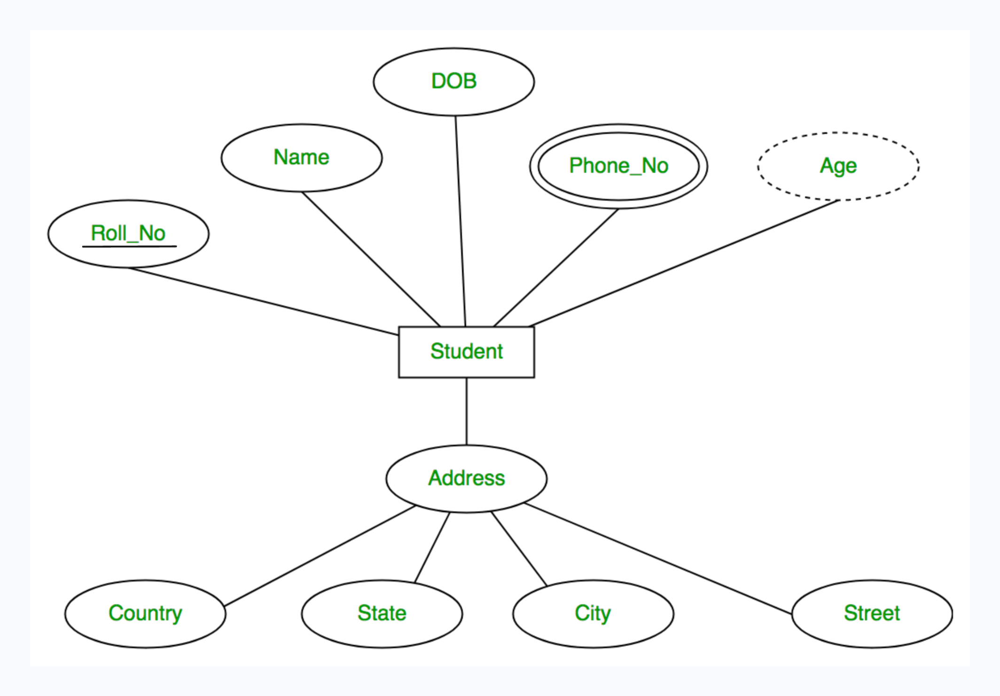
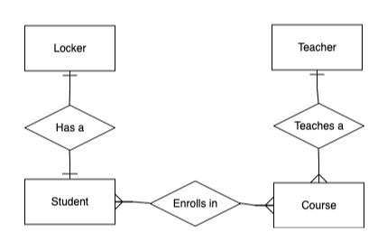

# Domain Modeling, Entity-Relationship Diagrams, and DB Schema Design

## Table of Contents

1. [Modeling a Domain](#modeling-a-domain)
2. [Entity Relationship Diagrams](#entity-relationship-diagrams)
3. [Designing an ER Diagram and Postgres Data Schema](#designing-an-er-diagram-and-schema)
4. [ERD Diagram: 32 Flavors: Modeling an ice cream store](#er-diagram-32-flavors-modeling-an-ice-cream-store)

## A Note on Creating ER Diagrams 

We will be using [ERDPlus](https://erdplus.com/) to create our Entity Relationship Diagrams. We recommend you use it as well. It does most of the hard work of creating the details of ER Diagrams, as you can see here:

## Modeling a domain

We will learn how design a database to help us solve real-world problems. We will learn some concepts and techniques used to *model* a *domain*, and then turn our model into a *schema* (tables, columns, relationships, etc) with SQL in Postgres.

Higher-level problem-solving skills like this are a huge part of software engineering and, along with the hard technical skills that let us turn our visions into working software, the kind of skills that employers are looking for.

You will find these skills help you be more efficient and productive, and, you will also be able to borrow from them when designing and building things other than databases.

*Example of an entity-relationship diagram*

### What is a domain?

A *domain*, is the term we use to describe the stuff in the real world we need to represent in our program or system.  To quote Wikipedia:

> A domain ... represents the target subject of a specific programming project, whether narrowly or broadly defined. For example, for a particular programming project that has as a goal the creation of a program for a particular hospital, that hospital would be the domain. Or, the project can be expanded in scope to include all hospitals as its domain

### What is modeling a domain?

Much of what we do as software engineers is *model* or *simulate* the real world.

To quote Wikipedia again:

> A domain model is a system of abstractions that describes selected aspects of a sphere of knowledge, influence or activity (a domain). The model can then be used to solve problems related to that domain. The domain model is a representation of meaningful real-world concepts pertinent to the domain that need to be modeled in software.

### Conceptual / Logical / Physical Data Models

A *data model* captures how we organize information about the things we care about in our domain. 

#### It is easier to begin designing a data model at a higher level of abstraction

Before worrying about if `customer.email` should be `VARCHAR(100)` or `VARCHAR(255)`, or even about foreign and primary keys, it is faster and easier to design our data model at the **conceptual level**.

There are **three traditional levels of data modeling.** Not every team will necessarily follow all three strictly. Often, all three – conceptual, logical, and physical data models – are compressed into one modeling exercise.

However, breaking the process down into these three levels can be valuable. Each step lays down a foundation for the next:

- **Conceptual:** The “what” model - **identifies business concepts**
  - *Example:* An Entity-Relationship diagram
- **Logical:** The “how” of the details - **defines data structure**
  - *Example:* The SQL defining our data schema (tables, etc) in Postgres
- **Physical:** The “how” of the implementation - **DB implementation details**
  - *Example:* Lower-level Postgres things like btrees and indices that we don't need to worry about, or even the details of how the data is stored on a hard drive.

*Image from [this article](https://bigdataanalyticsnews.com/difference-between-conceptual-logical-data-models/)*

Each level can vary depending on the situation. Later when we use Django ORM, we could consider Django Models the Logical level, and the actual SQL schema the physical level, as Django ORM actually generates our SQL for us.

### The importance of planning/modeling first

It is critical that you develop the habit of doing some *designing* or *planning* before *implementing* (writing code). Particularly with SQL and databases:

- It takes longer to make a change; up-front planning reduces the number of changes you make.
- **Once a bunch of code is written that depends on a database schema, changing that schema is hard.**
- Identifying bugs is not always straightforward.
- A flaw in a design may not be apparent until you've already written a lot of code.

Numerous studies of software engineer productivity show that catching bugs as early as possible saves companies (and devs!) time and money. Designing and planning up-front is the fastest and cheapest way to catch bugs.

Finally, your software projects are becoming larger, and take not hours, but days and eventually weeks. Project management and some designing/planning is essential.

## Entity Relationship Diagrams

We can use an *Entity Relationship Diagram* (ERD's) to design our *Conceptual Data Model*. ERD's are a great tool to know about, and while a formal ERD diagram has a lot of rules and specificity, we will focus on the most important things. You can use ERD diagrams to model all sorts of things when designing software but they're especially useful for designing our data model.

**Note: The excellent [ERDPlus](https://erdplus.com/) tool will make it easy for us to create ER Diagrams and not have to memorize what each symbol means.**

### Entity

Entities are PRIMARY THINGS of a domain about which we need to record data. Common Entity types are:

1. **People:** Humans who carry out some function: *Employees, Students, Customers.*
2. **Places:** Sites or locations: *Cities, Offices, Routes.*
3. **Things:** Tangible physical objects: *Equipment, Products, Buildings.*
4. **Organizations:** *Teams, Suppliers, Departments.*
5. **Events:** Things that happen to some other entity at a given date and time or as in an ordered sequence: *Employee promotions, Project phases, Account payments.*
6. **Concepts:** intangible ideas used to keep track of business or other activities: *Projects, Accounts, Complaints.*

In an ER Diagram Entities are represented with rectangles, as we'll see momentarily.

### Attributes

Attributes are properties of entities *or* relationships. Entities have two types of properties: identifying attributes and descriptive attributes. In an ER Diagram Attributes are represented with ovals.

Let's examine this ER Diagram of a **Student Entity** and it's Attributes.

#### Identifying attributes

Identifying attributes uniquely determine each instance of an entity type. They are called identifiers or keys.  

An identifying attribute will probably become the **primary key** of a table we'll create to represent our entity in our data schema.

- Identified with an underline.
- In this diagram the **Roll_No** (roll number) attribute uniquely identifies a Student entity.

#### Descriptive attributes

Descriptive attributes of *student* might include year, advisor, and grade point average. There are several kinds:

- **Composite attributes:** Composed of other attributes. 
  - A Student's *Address* in our diagram is a composite attribute.

- **Multivalued attribute:** May have multiple values for the same entity.
  - A Student may have multiple Phone Numbers.
  - Identified with a double oval.

- **Derived attribute:** It can be derived from other attributes on the same entity.
  - The Student's **Age** attribute can be derived from their **Date of Birth (DOB) attribute.**
  - Identified with a dotted oval.

### Relationships

A Relationship represents the association between entities. For example, ‘Enrolled in’ is a relationship type that exists between entity type Student and Course. In ER diagram, the relationship type is represented by a diamond and connecting the entities with lines.

#### Relationship Types & Diagram Symbols

- **Many** is indicated by the triangular "crows feet" on the relationship line.
- **One** is indicated by a cross-hatch straight line.

Let's see examples with our diagram. There are three main types of Relationships:

- **One to one:** Each *Student* has their own personal *Locker*. 
- **One to many:** Each *Course* has only one *Professor*, but a *Professor* teaches multiple *Courses*.
- **Many to many:** Each *Student* may enroll in multiple *Courses*, and each *Course* may have multiple *Students.*

There is more to ER Diagrams, but these are the most important things and more than enough to get us started. [You can read more about them here](https://www.geeksforgeeks.org/introduction-of-er-model/) and in the other articles linked under the "References" section.

## Designing an ER Diagram and Schema

*This process borrows from [A Practical Guide to Entity-Relationship Modeling](https://cci.drexel.edu/faculty/song/courses/info%20605/appendix/AppendixA.PDF)*

Now that we know what an ER Diagram is and what it looks like, how do we turn a real-world *problem* or *domain* into one?

1. Build the Conceptual Data Model (ER Diagram)
2. Build the Logical Data Model (Postgres Data Schema)

### 1. Build the Conceptual Data Model (ER Diagram)

1. Describe in plain language, aka stories
    1. Write a summary specification in plain English.
    2. Write a few 'stories': "A customer should be able to buy an ice cream cone", etc. A story should always have a **verb** and some **nouns** -- these will help define Entities & Relationships.
    3. Write down in plain English what we need to store in the database.
    4. Write  down in plain English a few useful queries.
    5. Write down in plain English *important* people, places, etc (see the Entity Types list from before).
2. Identify Entities
    1. Don't worry about attributes yet.
3. Identify Relationships - **don't worry about types**
4. Identify Relationship Types (1to1, 1toMany, etc)
5. Identify Attributes for Entities
6. Select Identifiers (Primary Key) for Entities
7. Select Primary & Foreign Keys for Relationship

As you do each step you may find you need to refine something from the previous step.

### 2. Build the Logical Data Model (Postgres Data Schema)

You may not always want to follow this exact order but it useful to break this down into steps:

1. Turn Entities into Tables
2. Turn Relationships into primary/foreign keys on our Tables, and add any additional tables (such as a "join table") needed to model those relationships.
3. Create some fake or "mock" data. **Do this early** as it will help you define your Column Data Types
4. Add our Entity Attributes as Columns w/Data Types on our Tables.
5. Insert our "mock" data into database, and then create and insert some more.
6. Run some meangingful SQL queries to verify correctness

As you do each step you may find you need to refine something from the previous step.

## References & Resources

- [A good article on Entity Relationship Models](https://www.geeksforgeeks.org/introduction-of-er-model/)

- [Dartmouth CS Lecture material on Entity Relationship Diagrams, with slides](https://www.cs.dartmouth.edu/~cs61/Lectures/04%20-%20ER%20Modeling/04%20-%20ER%20Modeling.html)

- [Crows Foot Notation & How to Read ERD Diagrams](https://www.freecodecamp.org/news/crows-foot-notation-relationship-symbols-and-how-to-read-diagrams/)

- [Excellent article on Conceptual/Logical/Physical Data Models](https://www.couchbase.com/blog/conceptual-physical-logical-data-models/)
  - [Same article saved in the Internet Archive (loads slower)](https://web.archive.org/web/20231102181134/https://www.couchbase.com/blog/conceptual-physical-logical-data-models/)

- [Paper: A Practical Guide to Entity-Relationship Modeling](https://cci.drexel.edu/faculty/song/courses/info%20605/appendix/AppendixA.PDF)

- [Wikipedia article on Domain Model](https://en.wikipedia.org/wiki/Domain_model)

- [Wikipedia article on Domain](https://en.wikipedia.org/wiki/Domain_(software_engineering))
