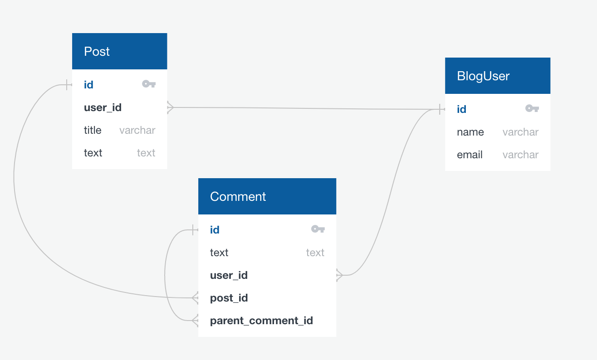

# SQL Schema Design: Blog

[Blog db](https://github.com/echoplatoonew/blog-db)

Today we're going to walk through designing and implementing the database schema for a blog.

### Entities
We're going to keep things as simple as possible and limit ourselves to three entities:
- BlogUser
- Post
- Comment


### Relationships
Now we'll think about how they should be connected.

- A Post should be made by a single BlogUser, and a BlogUser can make many Posts (one-to-many)
- A Comment should be made by a single BlogUser, and a BlogUser can make many Comments (one-to_many)
- A Comment can belong to a single Post, and a Post can have many Comments (one-to-many)
- A Comment can belong to a single Comment, and a Comment can have many Comments (one-to-many)

The last one is a bit tricky since the definition is recursive. 



Here is one way to implement this in SQL:

### SQL Implementation
```sql
CREATE TABLE BlogUser (
    id SERIAL PRIMARY KEY,
    name VARCHAR(100),
    email VARCHAR(255) NOT NULL
);

CREATE TABLE Post (
    id SERIAL PRIMARY KEY,
    user_id INTEGER REFERENCES BlogUser(id),
    title VARCHAR(255) NOT NULL,
    text TEXT
);

CREATE TABLE Comment (
    id SERIAL PRIMARY KEY,
    text TEXT,
    user_id INTEGER REFERENCES BlogUser(id),
    post_id INTEGER REFERENCES Post(id),
    parent_comment_id INTEGER REFERENCES Comment(id)
    CHECK (--optional
        (post_id IS NOT NULL AND parent_comment_id IS NULL) OR
        (post_id IS NULL AND parent_comment_id IS NOT NULL)
    )
);
```

### Queries
What is the name of the user with the most posts?
```sql
select count(*), BlogUser.name from BlogUser
join Post
on Post.user_id = BlogUser.id
group by BlogUser.name
order by count(*) desc
limit 1;
```
```bash
 count | name  
-------+-------
     7 | Jimbo
```

What are the top 3 comments with the most comments?
```sql
select count(*), c1.id as comment_id from Comment c1
join Comment c2 
on c1.id = c2.parent_comment_id
group by c1.id
order by count(*) desc
limit 3;
```
```sql
 count | comment_id 
-------+----
    12 |  2
     5 | 60
     3 | 81
```

### Advanced Queries (Do not worry about these)
Who wrote the comment with the most comments?
Note: This is much more advanced than anything you'll need to do for this course.
```sql
select BlogUser.name
from BlogUser
join (
  select *
  from Comment
  where Comment.id = (select max_comment_id 
  from (
    select count(*), c1.id as max_comment_id from Comment c1
    join Comment c2 
    on c1.id = c2.parent_comment_id
    group by c1.id
    order by count(*) desc
    limit 1
  ) as x)
) as max_comment
on BlogUser.id = max_comment.user_id;
```
```bash
  name   
---------
 Leodora
```


## Challenges
[Instagram Schema Design](https://github.com/echoplatoonew/instagram_schema)
