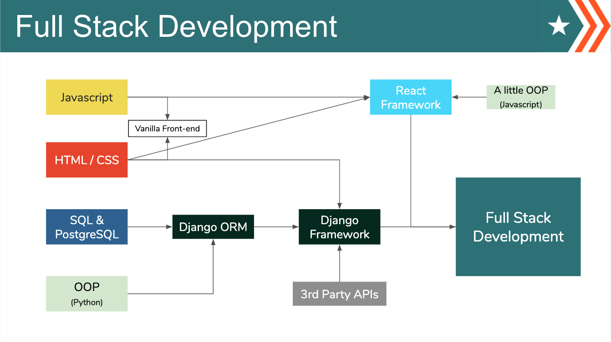

# Code Platoon Curriculum

## Getting Started

You can view our cohort's [curriculum calendar](https://docs.google.com/spreadsheets/d/1OFBrYsnRSmpgJOWq7rxwBummdR5eCAnqpWJMeqmm-do/edit#gid=0), which is broken down by weeks and days.

## Asking Questions in Slack / Slack Etiquette

Before anything, read through [Slack etiquette](https://slack.com/blog/collaboration/etiquette-tips-in-slack).

Questions should be asked in the #questions Slack channel using proper [formatting](https://slack.com/help/articles/202288908-Format-your-messages) (see Inline code section), not via TA or instructor DM. This reflects the industry norms - companies want their engineers to have discussions publicly so that questions can be easily searched and referenced.

Your questions should be pointed (not "Can someone help me?"), show that you’ve read through the code/error, should contain your thought process / some potential solutions, and should not be anything that is easily Google-able. Once you ask a question and find a solution, please update your question thread so that other students can benefit from seeing the question and answer.

## Daily Check-ins

It is important for you to have a place to talk about how you are feeling and how you feel you are progressing. Every morning before class starts, please fill out [this form](https://docs.google.com/forms/d/e/1FAIpQLSfZjxwlNH-f2mEMfrqPkO062Y58GeiGqNW8jdd_Ujvq31ZGDQ/viewform?usp=sf_link).

## What should I do if I finish everything on any given day?

1. Help those around you. Teaching solidifies learning.
2. Watch tomorrow's video to get yourself a leg up on the next day!
3. Go through [Code Wars](https://www.codewars.com/)
4. Visit [Pramp](https://www.pramp.com/promo/codeplatoon) to interview with other people - we have an agreement with them to get their premium plan for free!
5. [Interview Cake](https://www.interviewcake.com/)

## Video Links

Classroom videos/lectures will be recorded and posted to YouTube. It can take up to a few hours to process the video after recording, so please be patient if you don't see the video available online immediately after a lecture. If you want to refer back to the lecture content before the video is uploaded, you can look at the demo code in github, which is uploaded immediately after lectures finish.

1. [JavaScript & Python](https://www.youtube.com/playlist?list=PLu0CiQ7bzwESgW6swsJYXeNgEFXmY_m1w)
2. [Object Oriented Programming](https://www.youtube.com/playlist?list=PLu0CiQ7bzwESSwMZNV7tdn3Z1rer_GYHk)
3. [Data Structures](https://www.youtube.com/playlist?list=PLu0CiQ7bzwEShZghXM7gzhinxoftZqsK7)
4. [Intro to Full Stack](https://www.youtube.com/playlist?list=PLu0CiQ7bzwES_8z8zWInTcQOKobYMdCBY)
5. [Front End Dev (React)](https://www.youtube.com/playlist?list=PLu0CiQ7bzwEQtD0Lg2QziZ2N55jPeZJGV)
6. [SQL](https://www.youtube.com/playlist?list=PLu0CiQ7bzwESVWl04549ydqzRx1TAIdsi)
7. [Back End Dev (Django)](https://www.youtube.com/playlist?list=PLu0CiQ7bzwERD6_GVY-0EVHqxIg_wpyTC)

## Additional Resources Shared in Class

- [Pass-by-value vs pass-by-reference](https://gist.github.com/AloofBuddha/92ee6749a8be48c984881a4523f533c3)
- [CSS review](https://youtu.be/8qoOsZy-WbU)
